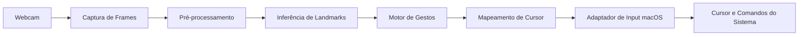

# TDD - VisionMouse Pro (macOS)

| Campo | Valor |
| --- | --- |
| Tech Lead | A definir |
| Product Manager | N/A |
| Time | A definir |
| Epic/Ticket | A definir |
| Design | N/A |
| Status | Draft |
| Criado em | 2026-05-10 |
| Última atualização | 2026-05-10 |

## Contexto

O VisionMouse Pro propõe uma camada de interação hands-free para macOS, substituindo parte do uso tradicional de mouse e teclado por gestos manuais capturados via webcam. O sistema usa visão computacional para identificar landmarks da mão em tempo real, interpretar gestos e convertê-los em eventos de entrada compatíveis com o sistema operacional.

O problema pertence ao domínio de acessibilidade, produtividade e interfaces naturais. Em vez de exigir periféricos físicos como único meio de interação, o produto busca oferecer uma alternativa de baixo atrito para navegação, clique, arraste e acionamento de comandos do sistema, preservando baixa latência e boa previsibilidade de uso.

Os principais stakeholders são usuários finais que buscam acessibilidade ou conveniência, engenharia responsável pela aplicação desktop e manutenção do pipeline de visão computacional, e o time de produto, que precisa avaliar a viabilidade de uma experiência utilizável em ambiente real, com diferentes condições de luz, câmera e postura.

## Definição do Problema e Motivação

### Problemas que estamos resolvendo

- Dependência de periféricos físicos como principal forma de interação no macOS.
  - Impacto: reduz acessibilidade e limita cenários de uso hands-free.
- Baixa naturalidade em fluxos de interação quando o usuário precisa alternar entre câmera, teclado e mouse.
  - Impacto: aumenta esforço cognitivo e reduz produtividade em tarefas simples.
- Dificuldade de traduzir movimentos humanos em comandos do sistema com estabilidade suficiente para uso contínuo.
  - Impacto: jitter, falsos positivos e latência degradam a confiança do usuário.

### Por que agora?

- Há maturidade suficiente em bibliotecas de visão computacional para detectar mãos e landmarks em tempo real em hardware de consumo.
- O macOS oferece integrações de acessibilidade e automação que permitem validar uma experiência quase nativa.
- O projeto é um bom candidato para um MVP técnico com aprendizado rápido sobre precisão, latência e ergonomia.

### Impacto de não resolver

- Negócio: o produto perde uma oportunidade de se diferenciar por acessibilidade e interface natural.
- Técnico: segue inexistente uma abstração estável entre visão computacional e eventos de entrada do sistema.
- Usuário: experiências hands-free continuam frágeis ou indisponíveis para uso cotidiano.

## Escopo

### Em escopo (V1 / MVP)

- Captura contínua de vídeo via webcam.
- Detecção de uma mão com landmarks em tempo real.
- Conversão de landmarks em coordenadas de cursor.
- Suporte a gestos básicos de navegação e clique.
- Suporte a pelo menos um gesto de arrastar.
- Integração com ações nativas do macOS relevantes para navegação.
- Mecanismo de suavização para reduzir jitter.
- Configuração inicial de permissões necessárias no macOS.

### Fora de escopo (V1)

- Suporte multiplataforma além de macOS.
- Reconhecimento de múltiplas mãos simultaneamente.
- Personalização avançada de gestos por usuário.
- Modelo treinado customizado para visão computacional.
- Overlay de UX avançado com onboarding visual completo.
- Analytics de produto e sincronização em nuvem.

### Considerações futuras (V2+)

- Perfis configuráveis por usuário.
- Teclado virtual com dwell time configurável.
- Modo adaptativo por contexto de uso.
- Suporte a múltiplos monitores.
- Calibração assistida e sensibilidade dinâmica.

## Solução Técnica

### Visão geral da arquitetura

A solução é organizada como um pipeline local de baixa latência com cinco responsabilidades principais: captura de vídeo, inferência de landmarks, interpretação de gestos, mapeamento espacial e emissão de eventos de entrada no macOS. O objetivo arquitetural é separar claramente a camada de percepção da camada de intenção e da camada de atuação, para permitir evolução do motor de gestos sem acoplamento direto ao mecanismo de controle do sistema.

### Componentes principais

- `Capture Layer`: recebe frames da webcam com taxa estável e prepara a imagem para inferência.
- `Vision Inference Layer`: detecta mão e extrai landmarks 2D/3D.
- `Gesture Engine`: interpreta postura, distância e movimento relativo entre landmarks para produzir intenções semânticas.
- `Cursor Mapping Engine`: converte coordenadas da câmera em coordenadas do espaço de tela com suavização e limites operacionais.
- `macOS Input Adapter`: traduz intenções de alto nível em eventos de cursor, clique e comandos do sistema.

### Diagrama de arquitetura



### Fluxo de dados

1. A webcam fornece frames continuamente para a camada de captura.
2. O frame é normalizado para inferência e alinhamento espacial.
3. A camada de visão computacional retorna landmarks da mão com confiança associada.
4. O motor de gestos avalia posição relativa, distância e movimento ao longo do tempo.
5. O mapeador converte o gesto ou ponto de referência em posição de tela.
6. O adaptador de input emite evento compatível com o macOS.
7. O sistema registra métricas operacionais para latência, detecção e falhas.

### Pipeline de processamento

1. Captura de frame em frequência alvo compatível com o hardware.
2. Pré-processamento com espelhamento e normalização da imagem.
3. Inferência de landmarks manuais.
4. Filtragem temporal para reduzir ruído.
5. Classificação de gesto e validação por limiar.
6. Tradução do gesto para ação do sistema.

### Contratos internos

#### Evento de landmark processado

```json
{
  "timestamp": "2026-05-10T12:00:00Z",
  "handDetected": true,
  "confidence": 0.94,
  "landmarks": [
    { "id": 8, "x": 0.52, "y": 0.34, "z": -0.02 }
  ]
}
```

#### Evento de intenção

```json
{
  "timestamp": "2026-05-10T12:00:00Z",
  "intent": "left_click",
  "sourceGesture": "thumb_index_pinch",
  "confidence": 0.89
}
```

### Mapeamento espacial

O sistema converte o espaço da câmera para o espaço de tela usando uma janela operacional com margem de segurança. Essa escolha reduz a chance de perder os cantos da tela por limitações ergonômicas do movimento da mão e permite calibrar sensibilidade sem reescrever o motor de gestos.

Uma estratégia de interpolação linear com bounding box controlada continua adequada para o MVP, desde que combinada com suavização temporal e limites mínimos para evitar micro-oscilações no cursor.

### Gestos previstos no MVP

| Capacidade | Gesto | Intenção do sistema |
| --- | --- | --- |
| Movimentação | Indicador como ponto de referência | Mover cursor |
| Clique esquerdo | Pinça entre polegar e indicador | Clique principal |
| Clique direito | Pinça entre polegar e dedo médio | Clique secundário |
| Arrastar | Pinça sustentada com movimento | `mouse down` + movimento |
| Navegação de workspace | Movimento horizontal rápido com múltiplos dedos | Ação nativa do macOS |

### Decisões de arquitetura

- Execução local em vez de processamento remoto.
  - Motivo: reduz latência, dependência de rede e exposição de vídeo.
- Separação entre inferência, gesto e adaptador de sistema.
  - Motivo: facilita testes, evolução dos gestos e troca de bibliotecas.
- Priorização de um conjunto enxuto de gestos para o MVP.
  - Motivo: reduz complexidade e melhora confiabilidade inicial.
- Integração com mecanismos nativos do macOS quando necessário.
  - Motivo: amplia cobertura funcional além do clique e movimento básicos.

## Requisitos Não Funcionais

### Performance

- Latência fim a fim alvo por ciclo de interação: baixa o suficiente para sensação de controle contínuo.
- Taxa de atualização visual alvo: estável para evitar saltos perceptíveis do cursor.
- Consumo de CPU: compatível com uso contínuo em máquina de desenvolvimento comum.

### Usabilidade

- O sistema deve privilegiar previsibilidade sobre agressividade de resposta.
- Gestos precisam ter baixa taxa de falso positivo em uso normal.
- A experiência deve tolerar pequenas variações de iluminação e posicionamento.

### Compatibilidade

- O MVP é projetado exclusivamente para macOS.
- O sistema depende de permissões de acessibilidade e captura de câmera concedidas pelo usuário.
- O runtime Python suportado para execução local deve vir de um interpretador nao-Xcode; o Python embutido no Xcode pode instalar uma variante de `mediapipe` sem `mediapipe.solutions`, incompatível com este MVP.

## Riscos

| Risco | Impacto | Probabilidade | Mitigação |
| --- | --- | --- | --- |
| Jitter e instabilidade do cursor | Alto | Alto | Aplicar suavização temporal, histerese e limiares mínimos de ativação |
| Falsos positivos de gesto | Alto | Médio | Exigir confirmação temporal curta e calibrar thresholds por gesto |
| Latência acima do aceitável em hardware mais fraco | Alto | Médio | Medir tempo por etapa, reduzir resolução de entrada e priorizar pipeline enxuto |
| Dependência de permissões do macOS | Médio | Alto | Documentar setup, validar permissões na inicialização e exibir estado operacional |
| Variações de iluminação e fundo | Médio | Médio | Testar em cenários reais e definir faixa mínima de confiabilidade |
| Acoplamento excessivo com APIs específicas do macOS | Médio | Médio | Isolar adaptador de sistema em camada própria |

## Considerações de Segurança

Apesar de não ser um sistema financeiro ou de autenticação, o projeto manipula vídeo em tempo real e controla ações do sistema operacional, então requer cuidados específicos.

### Proteção de dados

- O processamento de vídeo deve ocorrer localmente no dispositivo do usuário.
- Frames não devem ser persistidos por padrão.
- Logs não devem registrar imagens, coordenadas completas da mão por longos períodos nem dados sensíveis do sistema.

### Permissões e superfície de risco

- O aplicativo precisa de acesso à câmera.
- O aplicativo pode requerer permissões de acessibilidade para emitir eventos de entrada.
- O sistema deve falhar de forma segura quando permissões não estiverem disponíveis, sem tentar contornar controles do sistema.

### Boas práticas

- Validar claramente o estado das permissões antes de ativar comandos do sistema.
- Restringir a emissão de ações a um conjunto explícito de intenções suportadas.
- Evitar automações arbitrárias fora do escopo do produto.

## Estratégia de Testes

| Tipo de teste | Escopo | Objetivo |
| --- | --- | --- |
| Unitário | Mapeamento, suavização e regras de gesto | Validar lógica determinística |
| Integração | Pipeline entre captura, inferência e gesto | Validar fluxo operacional |
| Manual assistido | Uso real em macOS | Validar ergonomia, precisão e permissões |
| Performance | Latência por etapa e ciclo completo | Confirmar usabilidade em tempo real |

### Cenários críticos

- Movimento contínuo do cursor sem saltos bruscos.
- Clique esquerdo e direito sem disparos acidentais.
- Arrastar com manutenção estável de estado.
- Recuperação após perda temporária de detecção da mão.
- Degradação graciosa quando câmera ou permissão não estiverem disponíveis.
- Comandos nativos do macOS executados apenas quando o gesto esperado for confirmado.

## Monitoramento e Observabilidade

### Métricas recomendadas

| Métrica | Tipo | Uso |
| --- | --- | --- |
| `frame_processing_latency_ms` | Latência | Medir tempo fim a fim por frame |
| `hand_detection_confidence` | Qualidade | Acompanhar robustez da inferência |
| `gesture_recognition_rate` | Taxa | Medir gestos confirmados por tipo |
| `false_activation_count` | Erro funcional | Identificar gestos incorretos |
| `permission_state` | Estado | Diagnosticar falhas de setup |

### Logging estruturado

O sistema deve registrar eventos operacionais de forma leve, local e sem conteúdo sensível. O foco do log deve ser diagnóstico técnico, como perda de câmera, ausência de permissão, latência acima do alvo e falhas na emissão de eventos do sistema.

## Plano de Rollback

Como o projeto é um aplicativo local, rollback significa retornar a uma configuração operacional estável do produto e reduzir imediatamente comportamentos erráticos.

### Gatilhos de rollback

- Taxa alta de cliques involuntários.
- Latência que comprometa a usabilidade de forma consistente.
- Falhas recorrentes ao interagir com APIs de acessibilidade do macOS.
- Regressões que impeçam navegação básica do cursor.

### Estratégia

1. Desabilitar gestos não essenciais e manter apenas movimentação básica, se necessário.
2. Reverter para thresholds e parâmetros de suavização previamente validados.
3. Isolar ou desativar integrações nativas mais arriscadas, como ações de workspace.
4. Retornar para a versão estável anterior do aplicativo.

## Plano de Implementação

| Fase | Tarefa | Descrição | Owner | Status |
| --- | --- | --- | --- | --- |
| Fase 1 | Estruturar pipeline base | Captura, inferência e representação interna de landmarks | A definir | TODO |
| Fase 2 | Implementar mapeamento de cursor | Conversão câmera-tela com janela operacional e suavização | A definir | TODO |
| Fase 3 | Implementar motor de gestos | Regras para clique, clique direito e arrastar | A definir | TODO |
| Fase 4 | Integrar com macOS | Adaptador para eventos de cursor e comandos do sistema | A definir | TODO |
| Fase 5 | Validar experiência | Testes funcionais, performance e ergonomia | A definir | TODO |
| Fase 6 | Endurecimento do MVP | Ajustes de thresholds, logs e tratamento de falhas | A definir | TODO |

### Dependências

- Biblioteca de visão computacional com suporte estável a landmarks de mão.
- Webcam funcional e permissões concedidas pelo sistema.
- APIs de acessibilidade do macOS habilitadas para a aplicação.

### Sequência de entrega

1. Viabilizar movimentação estável do cursor.
2. Validar clique principal e clique secundário.
3. Adicionar arrastar com estado sustentado.
4. Introduzir ações nativas adicionais do macOS somente após estabilização do núcleo.

## Questões em Aberto

| Questão | Contexto |
| --- | --- |
| Qual a latência máxima aceitável para percepção de fluidez? | Precisa ser definida por testes práticos |
| O MVP suportará um ou mais monitores? | Afeta mapeamento espacial e usabilidade |
| Haverá calibração explícita por usuário? | Pode reduzir falsos positivos e fadiga |
| Quais comandos nativos do macOS entram no MVP? | Impacta complexidade e risco operacional |

## Resumo de Validação

### Seções obrigatórias

- Header e metadados: presente
- Contexto: presente
- Problema e motivação: presente
- Escopo: presente
- Solução técnica: presente
- Riscos: presente
- Plano de implementação: presente

### Seções críticas recomendadas

- Considerações de segurança: presente
- Estratégia de testes: presente
- Monitoramento e observabilidade: presente
- Plano de rollback: presente

## Próximos Passos Recomendados

- Preencher metadados pendentes como Tech Lead, time e vínculo com ticket/epic.
- Substituir metas qualitativas de performance por números obtidos em benchmarks reais.
- Refinar critérios de aceitação de cada gesto com base em testes práticos no macOS.
- Revisar o TDD após a primeira versão funcional do pipeline para consolidar decisões confirmadas.
